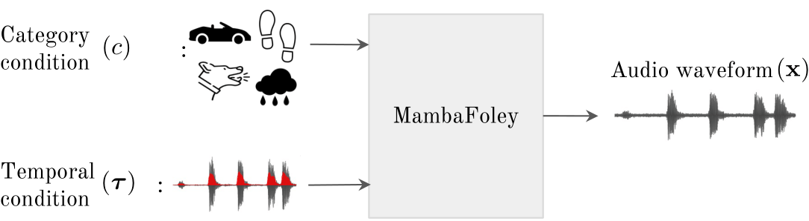
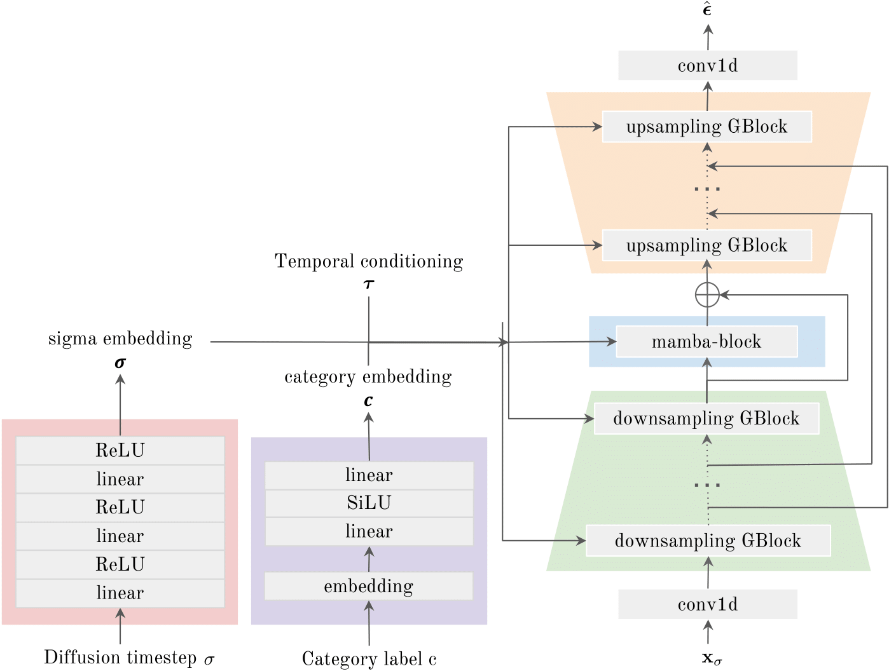

# MambaFoley: Foley Sound Generation using Selective State-Space Models
[](https://arxiv.org/abs/2409.09162) *Marco Furio Colombo, Francesca Ronchini, Luca Comanducci, Fabio Antonacci*

<p align="center">  
    
</p>

This repository contains the implementation of the paper, *[ MambaFoley: Foley Sound Generation using Selective State-Space Models](https://arxiv.org/abs/2409.09162)*, submitted to ICASSP 2024. 

In our paper, we propose ***MambaFoley***, a waveform generation model for ***Foley*** sound synthesis, which can generate high-quality audio considering both sound class and when sound should be arranged. For the generation task we employ a diffusion model, with mamba layers in the UNet bottleneck for audio sequence modeling.

<p align="center">  
    
</p>

## Setup
\
To get started, please prepare the codes and python environment.

1. Clone this repository:
    ```bash
    git clone https://github.com/FurioColombo/mamba-foley
    cd ./mamba-foley
    ```

2. Install the required dependencies by running the following command:
    ```bash
    # (Optional) Create a conda virtual environment
    conda create -n env-mamba-foley python=3.8.0
    conda activate env-mamba-foley
    # Install dependency with pip. Choose appropriate cuda version
    pip install torch==2.2.0 torchvision==0.17.0 torchaudio==2.2.0 --index-url https://download.pytorch.org/whl/cu118
    pip install -r requirements.txt
    ```


## Dataset

To train and evaluate our model, we used [DCASE 2023 Challenge Task 7](https://zenodo.org/records/8091972) which was constructed for Foley Sound Synthesis.
Click the link above links to download the corresponding datasets.

1. Download and unzip the [DCASE 2023 task 7 dataset](https://zenodo.org/records/8091972). Due to the mismatch between the provided csv and actual data files, please make valid filelists(.txt) using the provided scripts:
    ```bash
    wget http://zenodo.org/records/8091972/files/DCASE_2023_Challenge_Task_7_Dataset.tar.gz
    tar -zxvf DCASE_2023_Challenge_Task_7_Dataset.tar.gz
    rm DCASE_2023_Challenge_Task_7_Dataset.tar.gz
    sh scripts/bash/rename_dirs.sh
    sh scripts/bash/make_filelist.sh
    ```
   

## Scripts configurations
Every python script has a corresponding `.json` config file, which contains all settings for the script configuration.

### TODO: scripts fields description - how to do this??  

## Inference

To perform inference using our model, follow these steps:

TODO:
1. Download the pre-trained model weights and configurations from the following link: [prertrained.zip](https://zenodo.org/records/10826692).
    ```bash
    wget https://sandbox.zenodo.org/records/111421/files/pretrained.zip 
    ```

2. Unzip and place the downloaded model weights and config json file in the `./pretrained` directory.
    ```bash
    unzip pretrained.zip
    rm pretrained.zip
    ```
3. Check and edit the settings in the corresponding config file:
[inference_config.json](./config/inference/inference_config.json)<br>
<br>

4. Run the inference script by executing the following command:
    ```bash
    python scripts/python/inference/inference.py
    ```

## Training

To train the T-Foley model, follow these steps:

1. If you plan to use a dataset different from the _DCASE 2023 task 7 dataset_, download it and make prepare it in a dedicated folder.

2. If you use other dataset, prepare file path list of your training data as .txt format and configure its path in the
[training configuration file](config/training/train_config.json), changing the corresponding fields: `train_dirs`, `test_dirs`. <br> <br>

3. (optional) - recommended to skip this step <br>
   If you wish to load the conditioning from file instead of computing it on the go:
   - In the [training configuration file](config/training/train_config.json) set the values of the `'train_cond_dirs'`
   and `'train_cond_dirs'` fields to the .
   - Run:
   ```bash
   python scripts/python/dataset/create_cond_dataset.py
   ``` 
<br> <br>

5. Check the [training configuration file](config/training/train_config.json) settings, making sure it matches all your needs

4. Run the training:
    ```bash
    python scripts/python/training/train_model.py
    ```

    This will start the training process and save the trained model weights in the `train_logs/` directory.

    To see the training on tensorboard, run:
    ```bash
    tensorboard --logdir train_logs/
    ```


## Citation
```bibtex
@misc{colombo2024mambafoleyfoleysoundgeneration,
      title={MambaFoley: Foley Sound Generation using Selective State-Space Models}, 
      author={Marco Furio Colombo and Francesca Ronchini and Luca Comanducci and Fabio Antonacci},
      year={2024},
      eprint={2409.09162},
      archivePrefix={arXiv},
      primaryClass={eess.AS},
      url={https://arxiv.org/abs/2409.09162}, 
}
```


## License

This project is licensed under the MIT License. See the [LICENSE](LICENSE) file for more information.